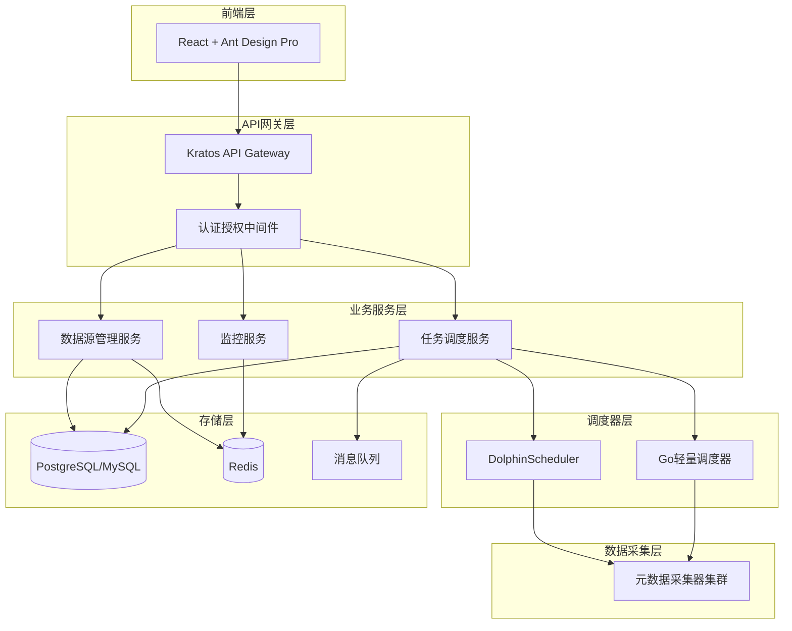

# Design Document

## Overview

数据源管理模块采用微服务架构设计，基于Kratos框架构建后端API服务，React + Ant Design Pro构建前端管理界面。系统支持多种数据源类型的统一管理，集成任务调度功能实现自动化的元数据采集。

核心设计理念：
- **插件化架构**：支持多种数据源类型的动态扩展
- **双调度器支持**：同时支持DolphinScheduler和轻量级Go调度器
- **统一API接口**：提供RESTful和gRPC双协议支持
- **高可用设计**：连接池管理、故障恢复、监控告警
- **安全优先**：权限控制、数据加密、审计日志

## Architecture

### 系统架构图



### 分层架构

**表现层 (Presentation Layer)**
- React前端应用
- RESTful API接口
- gRPC服务接口

**应用层 (Application Layer)**
- 数据源管理用例
- 任务调度用例
- 监控告警用例

**领域层 (Domain Layer)**
- 数据源实体和值对象
- 任务调度领域服务
- 业务规则和策略

**基础设施层 (Infrastructure Layer)**
- 数据库访问层
- 外部服务集成
- 消息队列处理

## Components and Interfaces

### 核心组件

#### 1. 数据源管理器 (DataSourceManager)

```go
type DataSourceManager interface {
    // 数据源CRUD操作
    CreateDataSource(ctx context.Context, req *CreateDataSourceRequest) (*DataSource, error)
    UpdateDataSource(ctx context.Context, req *UpdateDataSourceRequest) (*DataSource, error)
    DeleteDataSource(ctx context.Context, id string) error
    GetDataSource(ctx context.Context, id string) (*DataSource, error)
    ListDataSources(ctx context.Context, req *ListDataSourcesRequest) (*ListDataSourcesResponse, error)
    
    // 连接管理
    TestConnection(ctx context.Context, config *ConnectionConfig) (*ConnectionTestResult, error)
    GetConnectionStatus(ctx context.Context, id string) (*ConnectionStatus, error)
    RefreshConnectionStatus(ctx context.Context, id string) error
    
    // 批量操作
    BatchCreateDataSources(ctx context.Context, req *BatchCreateRequest) (*BatchOperationResult, error)
    BatchUpdateStatus(ctx context.Context, req *BatchUpdateStatusRequest) (*BatchOperationResult, error)
    
    // 模板管理
    CreateTemplate(ctx context.Context, req *CreateTemplateRequest) (*DataSourceTemplate, error)
    ListTemplates(ctx context.Context, dsType DataSourceType) ([]*DataSourceTemplate, error)
}
```

#### 2. 任务调度器 (TaskScheduler)

```go
type TaskScheduler interface {
    // 任务管理
    CreateTask(ctx context.Context, req *CreateTaskRequest) (*CollectionTask, error)
    UpdateTask(ctx context.Context, req *UpdateTaskRequest) (*CollectionTask, error)
    DeleteTask(ctx context.Context, id string) error
    GetTask(ctx context.Context, id string) (*CollectionTask, error)
    ListTasks(ctx context.Context, req *ListTasksRequest) (*ListTasksResponse, error)
    
    // 任务执行控制
    StartTask(ctx context.Context, id string) error
    StopTask(ctx context.Context, id string) error
    PauseTask(ctx context.Context, id string) error
    ResumeTask(ctx context.Context, id string) error
    
    // 任务监控
    GetTaskStatus(ctx context.Context, id string) (*TaskStatus, error)
    GetTaskExecutionHistory(ctx context.Context, req *TaskHistoryRequest) (*TaskHistoryResponse, error)
    GetTaskLogs(ctx context.Context, req *TaskLogsRequest) (*TaskLogsResponse, error)
}
```

#### 3. 调度器适配器 (SchedulerAdapter)

```go
type SchedulerAdapter interface {
    // 调度器类型
    GetSchedulerType() SchedulerType
    
    // 工作流管理
    CreateWorkflow(ctx context.Context, req *CreateWorkflowRequest) (*Workflow, error)
    UpdateWorkflow(ctx context.Context, req *UpdateWorkflowRequest) (*Workflow, error)
    DeleteWorkflow(ctx context.Context, id string) error
    
    // 执行控制
    TriggerWorkflow(ctx context.Context, id string, params map[string]interface{}) (*WorkflowExecution, error)
    StopWorkflowExecution(ctx context.Context, executionId string) error
    
    // 状态查询
    GetWorkflowStatus(ctx context.Context, id string) (*WorkflowStatus, error)
    GetExecutionLogs(ctx context.Context, executionId string) (*ExecutionLogs, error)
}
```

#### 4. 连接池管理器 (ConnectionPoolManager)

```go
type ConnectionPoolManager interface {
    // 连接池管理
    GetConnection(ctx context.Context, dsId string) (Connection, error)
    ReleaseConnection(ctx context.Context, dsId string, conn Connection) error
    
    // 池配置管理
    UpdatePoolConfig(ctx context.Context, dsId string, config *PoolConfig) error
    GetPoolStats(ctx context.Context, dsId string) (*PoolStats, error)
    
    // 健康检查
    HealthCheck(ctx context.Context, dsId string) (*HealthStatus, error)
    CleanupIdleConnections(ctx context.Context) error
}
```

### 外部接口

#### DolphinScheduler集成接口

```go
type DolphinSchedulerClient interface {
    // 项目管理
    CreateProject(ctx context.Context, req *CreateProjectRequest) (*Project, error)
    
    // 工作流定义
    CreateProcessDefinition(ctx context.Context, req *CreateProcessDefinitionRequest) (*ProcessDefinition, error)
    UpdateProcessDefinition(ctx context.Context, req *UpdateProcessDefinitionRequest) (*ProcessDefinition, error)
    
    // 任务执行
    StartProcessInstance(ctx context.Context, req *StartProcessInstanceRequest) (*ProcessInstance, error)
    GetProcessInstanceStatus(ctx context.Context, instanceId string) (*ProcessInstanceStatus, error)
    
    // 资源管理
    UploadResource(ctx context.Context, req *UploadResourceRequest) (*Resource, error)
    CreateDataSource(ctx context.Context, req *CreateDSDataSourceRequest) (*DSDataSource, error)
}
```

## Data Models

### 核心数据模型

#### 数据源模型

```go
type DataSource struct {
    ID          string                 `json:"id" gorm:"primaryKey"`
    Name        string                 `json:"name" gorm:"uniqueIndex;not null"`
    Type        DataSourceType         `json:"type" gorm:"not null"`
    Description string                 `json:"description"`
    Config      *ConnectionConfig      `json:"config" gorm:"type:jsonb"`
    Status      DataSourceStatus       `json:"status" gorm:"default:inactive"`
    Tags        []string              `json:"tags" gorm:"type:jsonb"`
    CreatedBy   string                `json:"created_by"`
    CreatedAt   time.Time             `json:"created_at"`
    UpdatedAt   time.Time             `json:"updated_at"`
    LastTestAt  *time.Time            `json:"last_test_at"`
}

type ConnectionConfig struct {
    Host         string            `json:"host"`
    Port         int               `json:"port"`
    Database     string            `json:"database,omitempty"`
    Username     string            `json:"username"`
    Password     string            `json:"password"` // 加密存储
    SSL          bool              `json:"ssl"`
    Timeout      int               `json:"timeout"`
    MaxConns     int               `json:"max_conns"`
    MaxIdleConns int               `json:"max_idle_conns"`
    Extra        map[string]string `json:"extra,omitempty"`
}

type DataSourceType string

const (
    DataSourceTypeMySQL      DataSourceType = "mysql"
    DataSourceTypePostgreSQL DataSourceType = "postgresql"
    DataSourceTypeOracle     DataSourceType = "oracle"
    DataSourceTypeSQLServer  DataSourceType = "sqlserver"
    DataSourceTypeMongoDB    DataSourceType = "mongodb"
    DataSourceTypeRedis      DataSourceType = "redis"
    DataSourceTypeKafka      DataSourceType = "kafka"
    DataSourceTypeRabbitMQ   DataSourceType = "rabbitmq"
    DataSourceTypeMinIO      DataSourceType = "minio"
)

type DataSourceStatus string

const (
    DataSourceStatusActive   DataSourceStatus = "active"
    DataSourceStatusInactive DataSourceStatus = "inactive"
    DataSourceStatusError    DataSourceStatus = "error"
    DataSourceStatusTesting  DataSourceStatus = "testing"
)
```

#### 采集任务模型

```go
type CollectionTask struct {
    ID              string                 `json:"id" gorm:"primaryKey"`
    Name            string                 `json:"name" gorm:"not null"`
    DataSourceID    string                 `json:"datasource_id" gorm:"not null"`
    DataSource      *DataSource            `json:"datasource" gorm:"foreignKey:DataSourceID"`
    Type            TaskType               `json:"type" gorm:"not null"`
    Config          *TaskConfig            `json:"config" gorm:"type:jsonb"`
    Schedule        *ScheduleConfig        `json:"schedule" gorm:"type:jsonb"`
    Status          TaskStatus             `json:"status" gorm:"default:inactive"`
    SchedulerType   SchedulerType          `json:"scheduler_type" gorm:"not null"`
    ExternalID      string                 `json:"external_id"` // 外部调度器中的ID
    CreatedBy       string                 `json:"created_by"`
    CreatedAt       time.Time              `json:"created_at"`
    UpdatedAt       time.Time              `json:"updated_at"`
    LastExecutedAt  *time.Time             `json:"last_executed_at"`
    NextExecuteAt   *time.Time             `json:"next_execute_at"`
}

type TaskConfig struct {
    IncludeSchemas []string          `json:"include_schemas,omitempty"`
    ExcludeSchemas []string          `json:"exclude_schemas,omitempty"`
    IncludeTables  []string          `json:"include_tables,omitempty"`
    ExcludeTables  []string          `json:"exclude_tables,omitempty"`
    BatchSize      int               `json:"batch_size"`
    Timeout        int               `json:"timeout"`
    RetryCount     int               `json:"retry_count"`
    Extra          map[string]string `json:"extra,omitempty"`
}

type ScheduleConfig struct {
    Type       ScheduleType `json:"type"`
    CronExpr   string       `json:"cron_expr,omitempty"`
    Interval   int          `json:"interval,omitempty"` // 秒
    StartTime  *time.Time   `json:"start_time,omitempty"`
    EndTime    *time.Time   `json:"end_time,omitempty"`
    Timezone   string       `json:"timezone"`
}

type TaskType string

const (
    TaskTypeFullCollection        TaskType = "full_collection"
    TaskTypeIncrementalCollection TaskType = "incremental_collection"
    TaskTypeSchemaOnly           TaskType = "schema_only"
    TaskTypeDataProfile          TaskType = "data_profile"
)

type TaskStatus string

const (
    TaskStatusActive    TaskStatus = "active"
    TaskStatusInactive  TaskStatus = "inactive"
    TaskStatusRunning   TaskStatus = "running"
    TaskStatusCompleted TaskStatus = "completed"
    TaskStatusFailed    TaskStatus = "failed"
    TaskStatusPaused    TaskStatus = "paused"
)

type SchedulerType string

const (
    SchedulerTypeDolphinScheduler SchedulerType = "dolphinscheduler"
    SchedulerTypeBuiltIn         SchedulerType = "builtin"
)
```

#### 任务执行记录模型

```go
type TaskExecution struct {
    ID           string                 `json:"id" gorm:"primaryKey"`
    TaskID       string                 `json:"task_id" gorm:"not null"`
    Task         *CollectionTask        `json:"task" gorm:"foreignKey:TaskID"`
    Status       ExecutionStatus        `json:"status" gorm:"not null"`
    StartTime    time.Time              `json:"start_time"`
    EndTime      *time.Time             `json:"end_time"`
    Duration     int64                  `json:"duration"` // 毫秒
    Result       *ExecutionResult       `json:"result" gorm:"type:jsonb"`
    ErrorMessage string                 `json:"error_message"`
    Logs         string                 `json:"logs" gorm:"type:text"`
    ExternalID   string                 `json:"external_id"` // 外部调度器执行ID
    CreatedAt    time.Time              `json:"created_at"`
}

type ExecutionResult struct {
    TablesProcessed   int               `json:"tables_processed"`
    RecordsProcessed  int64             `json:"records_processed"`
    ErrorsCount       int               `json:"errors_count"`
    WarningsCount     int               `json:"warnings_count"`
    ProcessingStats   map[string]int64  `json:"processing_stats"`
}

type ExecutionStatus string

const (
    ExecutionStatusPending   ExecutionStatus = "pending"
    ExecutionStatusRunning   ExecutionStatus = "running"
    ExecutionStatusCompleted ExecutionStatus = "completed"
    ExecutionStatusFailed    ExecutionStatus = "failed"
    ExecutionStatusCancelled ExecutionStatus = "cancelled"
)
```

### 数据库设计

#### 主要表结构

```sql
-- 数据源表
CREATE TABLE datasources (
    id VARCHAR(36) PRIMARY KEY,
    name VARCHAR(255) NOT NULL UNIQUE,
    type VARCHAR(50) NOT NULL,
    description TEXT,
    config JSONB NOT NULL,
    status VARCHAR(20) DEFAULT 'inactive',
    tags JSONB,
    created_by VARCHAR(255),
    created_at TIMESTAMP DEFAULT CURRENT_TIMESTAMP,
    updated_at TIMESTAMP DEFAULT CURRENT_TIMESTAMP,
    last_test_at TIMESTAMP
);

-- 采集任务表
CREATE TABLE collection_tasks (
    id VARCHAR(36) PRIMARY KEY,
    name VARCHAR(255) NOT NULL,
    datasource_id VARCHAR(36) NOT NULL,
    type VARCHAR(50) NOT NULL,
    config JSONB NOT NULL,
    schedule JSONB,
    status VARCHAR(20) DEFAULT 'inactive',
    scheduler_type VARCHAR(50) NOT NULL,
    external_id VARCHAR(255),
    created_by VARCHAR(255),
    created_at TIMESTAMP DEFAULT CURRENT_TIMESTAMP,
    updated_at TIMESTAMP DEFAULT CURRENT_TIMESTAMP,
    last_executed_at TIMESTAMP,
    next_execute_at TIMESTAMP,
    FOREIGN KEY (datasource_id) REFERENCES datasources(id)
);

-- 任务执行记录表
CREATE TABLE task_executions (
    id VARCHAR(36) PRIMARY KEY,
    task_id VARCHAR(36) NOT NULL,
    status VARCHAR(20) NOT NULL,
    start_time TIMESTAMP NOT NULL,
    end_time TIMESTAMP,
    duration BIGINT,
    result JSONB,
    error_message TEXT,
    logs TEXT,
    external_id VARCHAR(255),
    created_at TIMESTAMP DEFAULT CURRENT_TIMESTAMP,
    FOREIGN KEY (task_id) REFERENCES collection_tasks(id)
);

-- 数据源模板表
CREATE TABLE datasource_templates (
    id VARCHAR(36) PRIMARY KEY,
    name VARCHAR(255) NOT NULL,
    type VARCHAR(50) NOT NULL,
    description TEXT,
    config_template JSONB NOT NULL,
    is_system BOOLEAN DEFAULT FALSE,
    created_by VARCHAR(255),
    created_at TIMESTAMP DEFAULT CURRENT_TIMESTAMP,
    updated_at TIMESTAMP DEFAULT CURRENT_TIMESTAMP
);

-- 索引
CREATE INDEX idx_datasources_type ON datasources(type);
CREATE INDEX idx_datasources_status ON datasources(status);
CREATE INDEX idx_collection_tasks_datasource_id ON collection_tasks(datasource_id);
CREATE INDEX idx_collection_tasks_status ON collection_tasks(status);
CREATE INDEX idx_collection_tasks_scheduler_type ON collection_tasks(scheduler_type);
CREATE INDEX idx_task_executions_task_id ON task_executions(task_id);
CREATE INDEX idx_task_executions_status ON task_executions(status);
CREATE INDEX idx_task_executions_start_time ON task_executions(start_time);
```

## Correctness Properties

*A property is a characteristic or behavior that should hold true across all valid executions of a system-essentially, a formal statement about what the system should do. Properties serve as the bridge between human-readable specifications and machine-verifiable correctness guarantees.*

### Property 1: 数据源配置验证
*For any* 数据源配置请求，系统应该验证所有必需参数的完整性和格式正确性，并在验证失败时返回详细的错误信息
**Validates: Requirements 1.2, 1.5**

### Property 2: 数据源类型支持
*For any* 支持的数据源类型（MySQL、PostgreSQL、Oracle、SQL Server、MongoDB、Redis、Kafka、RabbitMQ、MinIO），系统应该提供对应的配置表单和连接处理逻辑
**Validates: Requirements 1.1, 1.4**

### Property 3: 数据源CRUD操作完整性
*For any* 数据源的创建、更新或删除操作，系统应该正确处理配置信息、测试连接并保存结果
**Validates: Requirements 1.3, 2.2**

### Property 4: 关联约束检查
*For any* 数据源删除请求，如果存在关联的采集任务，系统应该阻止删除操作并提示用户
**Validates: Requirements 2.3, 2.4**

### Property 5: 状态管理和审计
*For any* 数据源状态变更操作，系统应该更新状态、记录时间戳并生成审计日志
**Validates: Requirements 2.5, 2.6, 3.2**

### Property 6: 连接状态监控
*For any* 数据源，系统应该定期检查连接状态，在连接异常时生成告警，并支持手动刷新状态
**Validates: Requirements 3.1, 3.4, 3.5**

### Property 7: 任务配置验证
*For any* 采集任务创建请求，系统应该验证数据源连接有效性，并允许配置采集频率和范围
**Validates: Requirements 4.1, 4.3**

### Property 8: 执行模式支持
*For any* 采集任务，系统应该支持立即执行、定时执行和周期性执行三种模式
**Validates: Requirements 4.2**

### Property 9: 任务生命周期管理
*For any* 采集任务，系统应该支持启动、暂停、停止和删除操作，并在执行完成时记录结果和统计信息
**Validates: Requirements 4.4, 4.5**

### Property 10: 调度器适配
*For any* 调度器类型（DolphinScheduler或内置调度器），系统应该提供相应的API集成和功能支持，并允许运行时切换
**Validates: Requirements 5.1, 5.2, 5.3, 5.4, 5.5**

### Property 11: 任务执行监控
*For any* 任务执行，系统应该记录详细日志，在失败时提供错误详情和重试机制，并支持按条件筛选执行历史
**Validates: Requirements 6.1, 6.3, 6.4, 6.5**

### Property 12: 批量操作支持
*For any* 批量操作请求（状态变更、导入配置、创建任务），系统应该正确处理所有项目并提供操作结果反馈
**Validates: Requirements 7.1, 7.2, 7.3**

### Property 13: 配置导出格式
*For any* 数据源配置导出请求，系统应该生成有效的JSON或YAML格式文件
**Validates: Requirements 7.5**

### Property 14: 权限验证
*For any* API请求，系统应该验证用户身份和权限，支持基于角色的访问控制，并实施API访问频率限制
**Validates: Requirements 8.1, 8.2, 8.5**

### Property 15: 数据安全
*For any* 敏感信息存储操作，系统应该加密密码和密钥，并记录所有敏感操作的审计日志
**Validates: Requirements 8.3, 8.4**

### Property 16: 模板管理
*For any* 数据源类型，系统应该提供配置模板，支持模板的预填充、自定义保存、导入导出和参数修改
**Validates: Requirements 9.1, 9.2, 9.3, 9.4, 9.5**

### Property 17: 资源管理优化
*For any* 数据源连接，系统应该通过连接池管理复用和生命周期，支持动态调整池大小，并在高负载时限制并发任务数量
**Validates: Requirements 10.1, 10.2, 10.3**

### Property 18: 增量采集
*For any* 元数据采集任务，系统应该支持增量采集模式以减少资源消耗
**Validates: Requirements 10.4**

### Property 19: 监控指标
*For any* 系统运行状态，应该提供准确的资源使用情况监控指标
**Validates: Requirements 10.5**

## Error Handling

### 错误分类和处理策略

#### 1. 连接错误
- **网络连接超时**：实施重试机制，最多重试3次，每次间隔递增
- **认证失败**：立即返回错误，记录审计日志
- **权限不足**：返回详细的权限要求说明
- **数据库不存在**：提供数据库创建建议

#### 2. 配置错误
- **参数格式错误**：返回具体的格式要求和示例
- **必需参数缺失**：明确指出缺失的参数
- **参数值超出范围**：提供有效的取值范围

#### 3. 业务逻辑错误
- **重复名称**：提供名称唯一性检查和建议
- **依赖关系冲突**：详细说明冲突的依赖关系
- **状态转换无效**：说明当前状态和允许的转换

#### 4. 系统错误
- **资源不足**：提供资源使用情况和优化建议
- **服务不可用**：实施熔断机制，提供降级服务
- **数据一致性错误**：触发数据修复流程

### 错误响应格式

```go
type ErrorResponse struct {
    Code      string                 `json:"code"`
    Message   string                 `json:"message"`
    Details   string                 `json:"details,omitempty"`
    Timestamp time.Time              `json:"timestamp"`
    RequestID string                 `json:"request_id"`
    Metadata  map[string]interface{} `json:"metadata,omitempty"`
}
```

### 重试和恢复机制

#### 指数退避重试
```go
type RetryConfig struct {
    MaxRetries      int           `json:"max_retries"`
    InitialInterval time.Duration `json:"initial_interval"`
    MaxInterval     time.Duration `json:"max_interval"`
    Multiplier      float64       `json:"multiplier"`
}
```

#### 熔断器配置
```go
type CircuitBreakerConfig struct {
    FailureThreshold   int           `json:"failure_threshold"`
    RecoveryTimeout    time.Duration `json:"recovery_timeout"`
    HalfOpenMaxCalls   int           `json:"half_open_max_calls"`
}
```

## Testing Strategy

### 双重测试方法

本系统采用单元测试和属性测试相结合的综合测试策略：

#### 单元测试
- **具体示例验证**：测试特定的业务场景和边界条件
- **集成点测试**：验证组件间的接口和数据流
- **错误条件测试**：确保异常情况得到正确处理
- **边界值测试**：验证输入参数的边界值处理

#### 属性测试
- **通用属性验证**：通过随机输入验证系统的通用属性
- **不变量检查**：确保系统状态转换过程中的不变量
- **幂等性验证**：验证操作的幂等性特征
- **一致性检查**：确保数据的一致性和完整性

### 属性测试配置

**测试框架**：使用 [Testify](https://github.com/stretchr/testify) 和 [gopter](https://github.com/leanovate/gopter) 进行属性测试

**测试配置**：
- 每个属性测试最少运行 100 次迭代
- 使用随机种子确保测试的可重现性
- 每个测试必须标注对应的设计文档属性

**标注格式**：
```go
// Feature: datasource-management, Property 1: 数据源配置验证
func TestDataSourceConfigValidation(t *testing.T) {
    // 属性测试实现
}
```

### 测试覆盖范围

#### 核心功能测试
- 数据源CRUD操作的完整性
- 任务调度和执行的正确性
- 权限控制和安全机制
- 批量操作的事务性

#### 性能测试
- 连接池的并发性能
- 大量数据源的管理效率
- 任务调度的响应时间
- 系统资源使用优化

#### 集成测试
- DolphinScheduler API集成
- 数据库事务处理
- 消息队列通信
- 前后端API接口

### 测试数据管理

#### 测试数据生成
```go
type DataSourceGenerator struct {
    Types    []DataSourceType
    Configs  map[DataSourceType]*ConfigTemplate
    Faker    *gofakeit.Faker
}

func (g *DataSourceGenerator) Generate() *DataSource {
    // 生成随机但有效的数据源配置
}
```

#### 测试环境隔离
- 使用Docker容器提供隔离的测试数据库
- 每个测试用例使用独立的数据库事务
- 测试完成后自动清理测试数据

### 持续集成

#### 自动化测试流水线
1. **代码提交触发**：每次代码提交自动运行测试套件
2. **并行测试执行**：单元测试和属性测试并行执行
3. **覆盖率检查**：确保代码覆盖率达到85%以上
4. **性能基准测试**：监控关键操作的性能指标

#### 测试报告
- 生成详细的测试报告和覆盖率报告
- 属性测试失败时提供反例分析
- 性能测试结果趋势分析
- 集成测试的端到端验证结果 