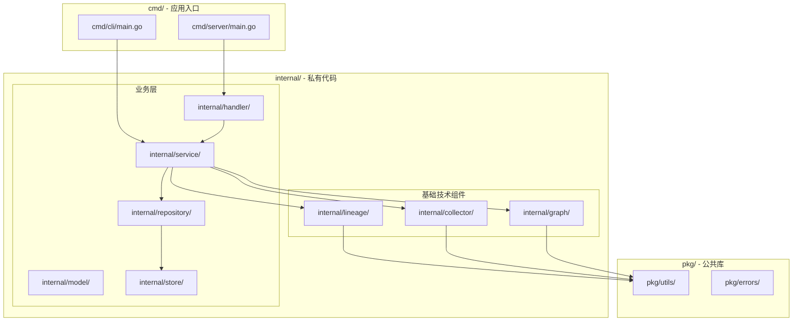

# Design Document

## Overview

本设计文档描述元数据管理系统的目录结构设计方案。系统遵循 Go 语言标准项目布局（golang-standards/project-layout），将代码组织为清晰的层次结构，包含三个基础技术组件（血缘解析、元数据采集、图数据库）和上层业务服务。

### 设计目标

1. 遵循 Go 社区标准项目布局
2. 保持组件间低耦合，支持独立开发和测试
3. 支持多种数据源和图数据库后端的扩展
4. 清晰分离基础技术组件与业务逻辑

## Architecture

### 整体架构图



### 目录结构总览

```
go-metadata/
├── cmd/                        # 可执行程序入口
│   ├── server/                # API 服务
│   │   └── main.go
│   └── cli/                   # CLI 工具
│       └── main.go
├── internal/                   # 私有代码（不可被外部导入）
│   ├── lineage/               # 血缘解析组件
│   │   ├── ast/              # AST 节点定义
│   │   ├── grammar/          # ANTLR 语法文件
│   │   ├── metadata/         # 元数据管理
│   │   ├── parser/           # 解析器生成代码
│   │   ├── tests/            # 测试用例
│   │   └── testdata/         # 测试数据
│   ├── collector/             # 元数据采集组件
│   │   ├── collector.go      # 接口定义
│   │   ├── types.go          # 类型定义
│   │   ├── mysql/            # MySQL 采集器
│   │   ├── postgres/         # PostgreSQL 采集器
│   │   └── hive/             # Hive 采集器
│   ├── graph/                 # 图数据库组件
│   │   ├── graph.go          # 接口定义
│   │   ├── types.go          # 类型定义
│   │   ├── nebula/           # NebulaGraph 适配器
│   │   └── neo4j/            # Neo4j 适配器
│   ├── service/               # 业务服务层
│   │   ├── metadata/         # 元数据管理服务
│   │   ├── lineage/          # 血缘查询服务
│   │   └── asset/            # 数据资产服务
│   ├── model/                 # 业务数据模型
│   ├── repository/            # 数据访问层
│   ├── handler/               # HTTP/gRPC 处理器
│   │   ├── http/             # HTTP 处理器
│   │   └── grpc/             # gRPC 处理器
│   └── store/                 # 存储实现
│       ├── mysql/            # MySQL 存储
│       └── postgres/         # PostgreSQL 存储
├── pkg/                        # 可导出的公共库
│   ├── utils/                 # 工具函数
│   └── errors/                # 错误定义
├── api/                        # API 定义
│   ├── openapi/              # OpenAPI/Swagger 定义
│   └── proto/                # protobuf 定义
├── configs/                    # 配置文件模板
│   └── config.yaml.example
├── scripts/                    # 脚本
│   ├── build.sh
│   └── test.sh
├── deployments/                # 部署配置
│   ├── docker/
│   └── kubernetes/
├── migrations/                 # 数据库迁移
├── test/                       # 集成测试
├── docs/                       # 文档
├── examples/                   # 示例代码
├── go.mod
├── go.sum
├── Makefile
└── README.md
```

## Components and Interfaces

### 1. 血缘解析组件 (internal/lineage/)

保持现有结构，从 `core/lineage` 迁移至 `internal/lineage`。

```go
// internal/lineage/lineage.go
package lineage

// Analyzer SQL 血缘分析器
type Analyzer struct {
    catalog Catalog
}

// Analyze 分析 SQL 语句，返回血缘结果
func (a *Analyzer) Analyze(sql string) (*LineageResult, error)

// Catalog 元数据目录接口
type Catalog interface {
    GetTable(database, table string) (*TableSchema, bool)
    GetColumns(database, table string) []string
}
```

### 2. 元数据采集组件 (internal/collector/)

```go
// internal/collector/collector.go
package collector

import "context"

// Collector 元数据采集器接口
type Collector interface {
    // Connect 建立数据源连接
    Connect(ctx context.Context) error
    // Close 关闭连接
    Close() error
    // ListDatabases 列出所有数据库
    ListDatabases(ctx context.Context) ([]string, error)
    // ListTables 列出指定数据库的所有表
    ListTables(ctx context.Context, database string) ([]string, error)
    // GetTableSchema 获取表结构
    GetTableSchema(ctx context.Context, database, table string) (*TableSchema, error)
    // GetAllSchemas 获取所有表结构
    GetAllSchemas(ctx context.Context) ([]*TableSchema, error)
}

// Config 采集器配置
type Config struct {
    Host     string
    Port     int
    User     string
    Password string
    Database string
    Options  map[string]string
}
```

```go
// internal/collector/types.go
package collector

// TableSchema 表结构定义
type TableSchema struct {
    Database    string        `json:"database"`
    Table       string        `json:"table"`
    TableType   string        `json:"table_type"`
    Columns     []Column      `json:"columns"`
    PrimaryKey  []string      `json:"primary_key,omitempty"`
    Indexes     []Index       `json:"indexes,omitempty"`
    Comment     string        `json:"comment,omitempty"`
}

// Column 列定义
type Column struct {
    Name       string `json:"name"`
    DataType   string `json:"data_type"`
    Nullable   bool   `json:"nullable"`
    PrimaryKey bool   `json:"primary_key"`
    Comment    string `json:"comment,omitempty"`
}

// Index 索引定义
type Index struct {
    Name    string   `json:"name"`
    Columns []string `json:"columns"`
    Unique  bool     `json:"unique"`
}
```

### 3. 图数据库组件 (internal/graph/)

```go
// internal/graph/graph.go
package graph

import "context"

// GraphDB 图数据库接口
type GraphDB interface {
    // Connect 建立连接
    Connect(ctx context.Context) error
    // Close 关闭连接
    Close() error
    
    // 节点操作
    CreateNode(ctx context.Context, node *Node) error
    GetNode(ctx context.Context, id string) (*Node, error)
    UpdateNode(ctx context.Context, node *Node) error
    DeleteNode(ctx context.Context, id string) error
    
    // 边操作
    CreateEdge(ctx context.Context, edge *Edge) error
    GetEdge(ctx context.Context, id string) (*Edge, error)
    DeleteEdge(ctx context.Context, id string) error
    
    // 查询操作
    GetUpstream(ctx context.Context, nodeID string, depth int) ([]*Node, []*Edge, error)
    GetDownstream(ctx context.Context, nodeID string, depth int) ([]*Node, []*Edge, error)
    GetLineage(ctx context.Context, nodeID string, depth int) (*LineageGraph, error)
    
    // 批量操作
    BatchCreateNodes(ctx context.Context, nodes []*Node) error
    BatchCreateEdges(ctx context.Context, edges []*Edge) error
}

// Config 图数据库配置
type Config struct {
    Type     string // "nebula" or "neo4j"
    Host     string
    Port     int
    User     string
    Password string
    Space    string // NebulaGraph space 或 Neo4j database
}
```

```go
// internal/graph/types.go
package graph

// Node 图节点
type Node struct {
    ID         string            `json:"id"`
    Type       NodeType          `json:"type"`
    Name       string            `json:"name"`
    Database   string            `json:"database,omitempty"`
    Table      string            `json:"table,omitempty"`
    Column     string            `json:"column,omitempty"`
    Properties map[string]any    `json:"properties,omitempty"`
}

// NodeType 节点类型
type NodeType string

const (
    NodeTypeDatabase NodeType = "database"
    NodeTypeTable    NodeType = "table"
    NodeTypeColumn   NodeType = "column"
    NodeTypeJob      NodeType = "job"
)

// Edge 图边
type Edge struct {
    ID         string            `json:"id"`
    Type       EdgeType          `json:"type"`
    SourceID   string            `json:"source_id"`
    TargetID   string            `json:"target_id"`
    Properties map[string]any    `json:"properties,omitempty"`
}

// EdgeType 边类型
type EdgeType string

const (
    EdgeTypeContains   EdgeType = "contains"    // 包含关系
    EdgeTypeDependsOn  EdgeType = "depends_on"  // 依赖关系
    EdgeTypeProducedBy EdgeType = "produced_by" // 产出关系
)

// LineageGraph 血缘图
type LineageGraph struct {
    Nodes []*Node `json:"nodes"`
    Edges []*Edge `json:"edges"`
}
```

### 4. 业务服务层 (internal/service/)

```go
// internal/service/metadata/service.go
package metadata

import (
    "context"
    "go-metadata/internal/collector"
    "go-metadata/internal/graph"
)

// Service 元数据管理服务
type Service struct {
    collectors map[string]collector.Collector
    graphDB    graph.GraphDB
}

// SyncMetadata 同步元数据
func (s *Service) SyncMetadata(ctx context.Context, source string) error

// GetTableMetadata 获取表元数据
func (s *Service) GetTableMetadata(ctx context.Context, database, table string) (*TableMetadata, error)
```

```go
// internal/service/lineage/service.go
package lineage

import (
    "context"
    "go-metadata/internal/graph"
    lineageCore "go-metadata/internal/lineage"
)

// Service 血缘查询服务
type Service struct {
    analyzer *lineageCore.Analyzer
    graphDB  graph.GraphDB
}

// AnalyzeSQL 分析 SQL 血缘
func (s *Service) AnalyzeSQL(ctx context.Context, sql string) (*lineageCore.LineageResult, error)

// GetColumnLineage 获取列级血缘
func (s *Service) GetColumnLineage(ctx context.Context, database, table, column string, depth int) (*graph.LineageGraph, error)
```

## Data Models

### 业务数据模型 (internal/model/)

```go
// internal/model/datasource.go
package model

import "time"

// DataSource 数据源
type DataSource struct {
    ID        string    `json:"id"`
    Name      string    `json:"name"`
    Type      string    `json:"type"` // mysql, postgres, hive, etc.
    Host      string    `json:"host"`
    Port      int       `json:"port"`
    Database  string    `json:"database"`
    CreatedAt time.Time `json:"created_at"`
    UpdatedAt time.Time `json:"updated_at"`
}

// TableMetadata 表元数据
type TableMetadata struct {
    ID           string    `json:"id"`
    DataSourceID string    `json:"datasource_id"`
    Database     string    `json:"database"`
    Table        string    `json:"table"`
    TableType    string    `json:"table_type"`
    Columns      []Column  `json:"columns"`
    RowCount     int64     `json:"row_count,omitempty"`
    SizeBytes    int64     `json:"size_bytes,omitempty"`
    CreatedAt    time.Time `json:"created_at"`
    UpdatedAt    time.Time `json:"updated_at"`
}

// Column 列元数据
type Column struct {
    Name       string `json:"name"`
    DataType   string `json:"data_type"`
    Nullable   bool   `json:"nullable"`
    PrimaryKey bool   `json:"primary_key"`
    Comment    string `json:"comment,omitempty"`
}
```


## Correctness Properties

*A property is a characteristic or behavior that should hold true across all valid executions of a system-essentially, a formal statement about what the system should do. Properties serve as the bridge between human-readable specifications and machine-verifiable correctness guarantees.*

由于本设计主要是目录结构设计，涉及的是代码组织方式而非功能实现，大部分需求是关于代码放置位置的约定，不涉及可测试的运行时行为。以下是可验证的属性：

### Property 1: 采集器接口一致性

*For any* 数据源采集器实现（MySQL、PostgreSQL、Hive 等），调用 `GetTableSchema` 返回的 `TableSchema` 结构应包含完整的表名、列信息，且列信息不为空。

**Validates: Requirements 3.4**

### Property 2: 图数据库接口一致性

*For any* 图数据库实现（NebulaGraph、Neo4j），创建节点后通过 `GetNode` 查询应返回相同的节点数据。

**Validates: Requirements 5.5**

### Property 3: 血缘图完整性

*For any* 血缘查询结果，返回的 `LineageGraph` 中所有边的 `SourceID` 和 `TargetID` 都应存在于节点列表中。

**Validates: Requirements 5.2, 5.3, 5.4**

## Error Handling

### 采集器错误处理

```go
// internal/collector/errors.go
package collector

import "errors"

var (
    ErrConnectionFailed = errors.New("failed to connect to data source")
    ErrDatabaseNotFound = errors.New("database not found")
    ErrTableNotFound    = errors.New("table not found")
    ErrPermissionDenied = errors.New("permission denied")
)
```

### 图数据库错误处理

```go
// internal/graph/errors.go
package graph

import "errors"

var (
    ErrConnectionFailed = errors.New("failed to connect to graph database")
    ErrNodeNotFound     = errors.New("node not found")
    ErrEdgeNotFound     = errors.New("edge not found")
    ErrInvalidNodeType  = errors.New("invalid node type")
    ErrInvalidEdgeType  = errors.New("invalid edge type")
)
```

## Testing Strategy

### 单元测试

- 单元测试文件与源文件放在同一目录，使用 `_test.go` 后缀
- 使用表驱动测试（Table-Driven Tests）
- 使用 `testify` 库进行断言

### 集成测试

- 集成测试放置在 `test/` 目录下
- 使用 Docker Compose 启动测试依赖（MySQL、PostgreSQL、NebulaGraph、Neo4j）
- 测试数据放置在 `test/testdata/` 目录

### 属性测试

- 使用 `gopter` 库进行属性测试
- 每个属性测试运行至少 100 次迭代
- 属性测试标注对应的设计属性编号

```go
// 示例：采集器接口一致性属性测试
// Feature: metadata-system-structure, Property 1: 采集器接口一致性
func TestCollectorInterfaceConsistency(t *testing.T) {
    properties := gopter.NewProperties(gopter.DefaultTestParameters())
    
    properties.Property("GetTableSchema returns complete schema", prop.ForAll(
        func(database, table string) bool {
            schema, err := collector.GetTableSchema(ctx, database, table)
            if err != nil {
                return true // 允许错误情况
            }
            return schema.Table != "" && len(schema.Columns) > 0
        },
        gen.AlphaString(),
        gen.AlphaString(),
    ))
    
    properties.TestingRun(t)
}
```

### 测试覆盖率目标

- 核心组件（lineage、collector、graph）：80% 以上
- 业务服务层：70% 以上
- 处理器层：60% 以上
